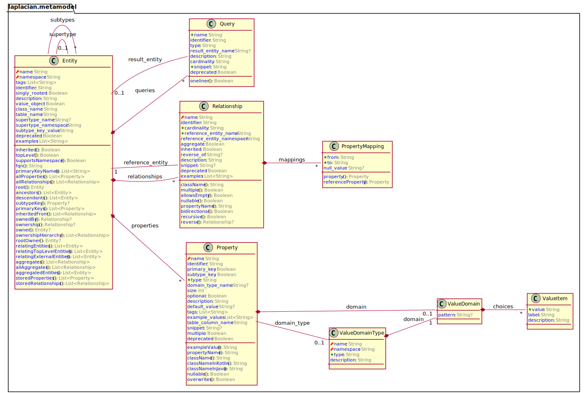

# Laplacian Core

<!-- @model_overview@ -->
### Model overview

The following diagram explains the entities included in this module.

### Entity list
- [**Entity**](<./doc/entities/Entity.md>)
An entity describing a entity.
- [**Property**](<./doc/entities/Property.md>)
An entity describing a property.
- [**PropertyMapping**](<./doc/entities/PropertyMapping.md>)
An entity describing a property_mapping.
- [**Query**](<./doc/entities/Query.md>)
The queries from which all navigation originates.

- [**Relationship**](<./doc/entities/Relationship.md>)
An entity describing a relationship.
- [**ValueDomain**](<./doc/entities/ValueDomain.md>)
An entity describing a value_domain.
- [**ValueDomainType**](<./doc/entities/ValueDomainType.md>)
An entity describing a value_domain_type.
- [**ValueItem**](<./doc/entities/ValueItem.md>)
An entity describing a value_item.

<!-- @model_overview@ -->